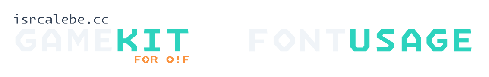
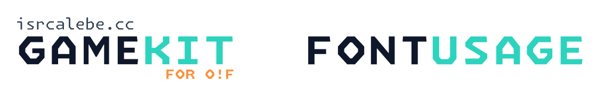

  
  

An incremental [`FontUsage`](https://github.com/ppy/osu-framework/blob/master/osu.Framework/Graphics/Sprites/FontUsage.cs#L14) generator for the [osu!framework](https://github.com/ppy/osu-framework)

# Disclaimer

**This project is not affiliated with the official osu!framework or ppy.** We have created these libraries to enhance the GameKit experience,but they are independent of the official osu!framework repository and do not represent the official osu!framework team or its distribution.

> For more information about the official osu!framework, visit [osu!framework GitHub](https://github.com/ppy/osu-framework).

# License

This project is licensed under the [MIT License](https://opensource.org/licenses/mit). Please see [the license file](../../../COPYING) for more information. [tl;dr](https://www.tldrlegal.com/license/mit-license) you can do whatever you want as long as you include the original copyright and license notice in any copy of the software/source.

