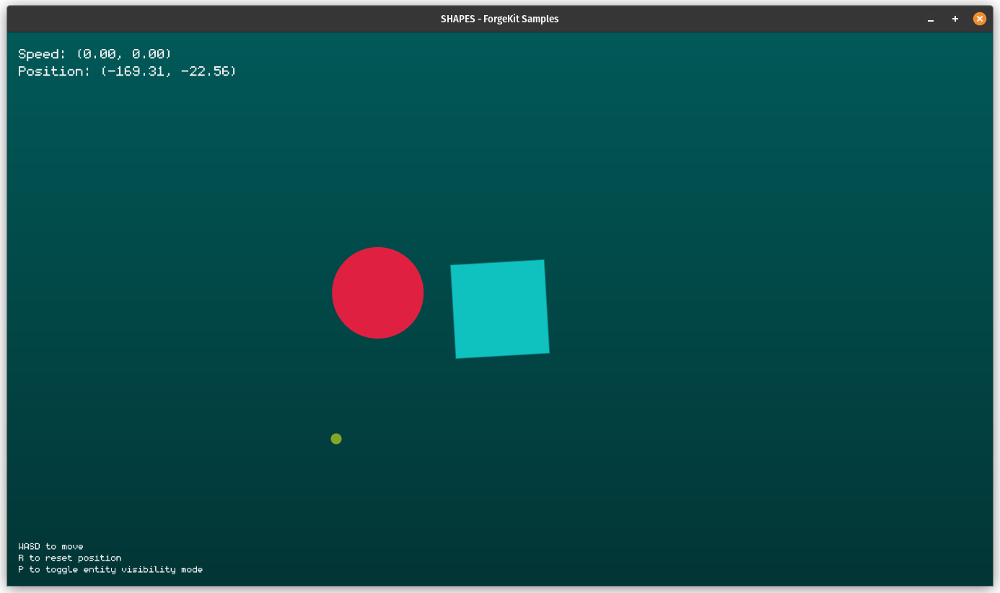

<p align='center'>
    
</p>

A simple application thats displays interactive shapes on the screen.

## How it Works

The shapes can be moved using the keyboard and reset to their original position. The application also displays information about the shapes, such as their position and size.

### Key Components

1. **Interactive Movement**
	- The red circle [`MovableCircle`](source/game/Screens/Elements/MovableCircle.cs) can be moved using the `WASD` keys. The `R` key resets the circle to its original position.
	- Movement is affected by **acceleration** and **deceleration**:
		- **Acceleration:** Increases speed while a directional key is pressed.
		- **Deceleration:** Gradually slows the circle when no keys are pressed.
	- Movement speed is capped at a configurable `MaxSpeed`.

2. **Rotating Box**
	- The blue box [`RotatingBox`](source/game/Screens/Elements/RotatingBox.cs.cs) rotates continuously, adding a dynamic visual element.

3. **Mouse-Tracking Cursor**
	- The circle [`TrackingCircle`](source/game/Screens/Elements/TrackingCircle.cs) follows the mouse pointer's position in real time.
		> See also [`CursorContainer`](https://github.com/ppy/osu-framework/blob/f3af3c9902f97a568e79cb7c8afe33405908ff21/osu.Framework/Graphics/Cursor/CursorContainer.cs), it provides cursor functionality.

4. **Real-Time HUD**
	- Displays real-time information about [`MovableCircle`](source/game/Screens/Elements/MovableCircle.cs).
		- `Position`: The current position of the red circle.
		- `Speed`: The current velocity of the red circle.

5. **Game Actions**
	- Pressing the **R** key on your keyboard (`GameAction.ResetPosition`) resets the position and speed of the red circle to their default values.
	- Pressing the **R** key on the keyboard (`GameAction.ToggleEntityInfo`) toggles the visibility mode of the [`EntityInfo`](source/game/Screens/Elements/EntityInfo.cs).


### Running the Project

To run the project, execute the following command in the terminal:

```sh
dotnet run --project source/platforms/desktop/
```

---

> This project was generated using [ForgeKit Desktop Empty Game](../../forgekit/templates/forgekit-of-desktop/) template.

#### Authors

- [**Israel Calebe** (@isrcalebe)](https://github.com/isrcalebe)
